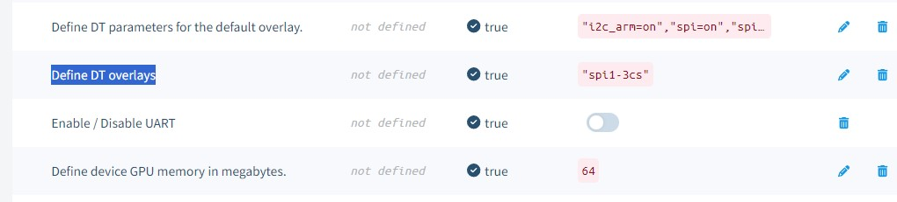
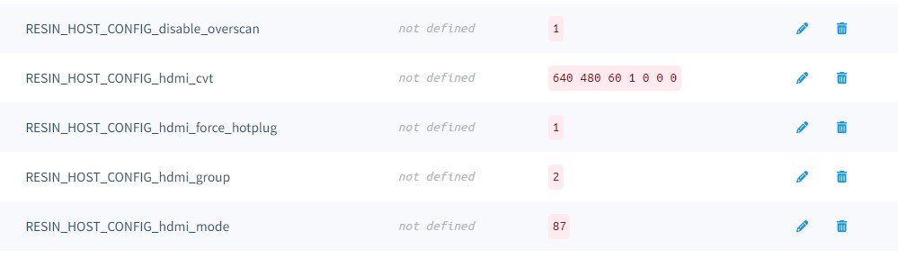

# Pumpkin-eyes
A spooky Halloween pumpkin with roving LCD eyes

## Hardware
- Two 128 x 128 pixel TFT LCDs - Only these models will work! [1.44 TFT](https://www.adafruit.com/product/2088) | [1.5 OLED](https://www.adafruit.com/product/1431) | [1.54 OLED](https://www.adafruit.com/product/3787)
- [Adafruit Animated Eyes Bonnet for Raspberry Pi](https://www.adafruit.com/product/3356)
- A Raspberry Pi Zero, Zero W, 2, 3, 3A+, 3B+ (Only Pis with a 32 bit balenaOS available -NOT Pi 4, 5, Zero 2W)
- F to F jumper wires ("jumper jerky") such as [these](https://www.adafruit.com/product/793)
- microSD card and power supply

Set up the hardware according to this page: https://learn.adafruit.com/animated-snake-eyes-bonnet-for-raspberry-pi/hardware-assembly.

## Software

- You must create a balenaCloud fleet using a 32 bit balenaOS device such as a Pi2, Pi Zero, Pi 3 (NOT 64 bit OS)
- Push this application to balena and it will download and install all of the software needed for the animated eyes.
  (If you are new to balena, check out this [getting started guide](https://www.balena.io/docs/learn/getting-started/raspberrypi3/nodejs/).)
- Alternately, click the button below to deploy the code to your fleet

## Settings
In the device's configuration page, you'll need to change these items to the following Device values:

| Device configuration "Name" | Device value |
|---------------------------|--------------|
| Define device GPU memory in megabytes. | 64 |
| Enable / Disable UART | (disabled) |
| Define DT parameters for the default overlay. | "i2c_arm=on","spi=on","spi1=on" |
| Define DT overlays | "spi1-3cs" |

Your "Device Configuration" should look like this:

In order for the graphics to render properly, you'll need to add some fleet configuration variables to the application. Add the following:

| Variable  | Type | Value |
| ------------- | ------------- | ------------- |
| RESIN_HOST_CONFIG_disable_overscan | Custom configuration variable | 1 |
| RESIN_HOST_CONFIG_hdmi_cvt | Custom configuration variable | 640 480 60 1 0 0 0 |
| RESIN_HOST_CONFIG_hdmi_force_hotplug | Custom configuration variable | 1 |
| RESIN_HOST_CONFIG_hdmi_group | Custom configuration variable | 2 |
| RESIN_HOST_CONFIG_hdmi_mode | Custom configuration variable | 87 |

Once you change the values, the device will reboot and the animated eyes should appear on the screen after a minute or two.

Your configuration should look like this:

## Pumpkin
Carve a pumpkin (carefully if you use a knife!) or place this project inside any type of Halloween decoration. Just be sure to allow for proper ventilation of the Pi if using an enclosed space. 

## Add-Ons
The bonnet supports the use of buttons and a joystick to control the eyes. You could also add some LEDs and a motion sensor to liven up your pumpkin installation.

## Notes
GPIO halt is installed but not active. To use, add /usr/local/bin/gpio-halt $HALT_PIN (where $HALT_PIN is the GPIO pin you want to use) to the startup.sh file and re-push application.
ADC is also installed and available from the bonnet.

