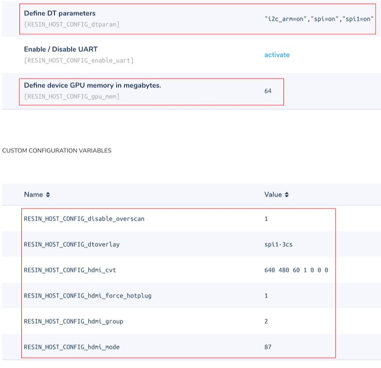

# Pumpkin-eyes
A spooky Halloween pumpkin with roving LCD eyes

## Hardware
This project uses two 128 x 128 pixel TFT LCDs from Adafruit and the Animated Eyes Bonnet along with a Raspberry Pi 3 (A Pi Zero or Pi 2 should also work.) Set up the hardware according to this page: https://learn.adafruit.com/animated-snake-eyes-bonnet-for-raspberry-pi/hardware-assembly

## Software
Push this application to balena and it will download and install all of the software needed for the animated eyes.
If you are new with balena, check out this [getting started guide](https://www.balena.io/docs/learn/getting-started/raspberrypi3/nodejs/).

## Settings
In order for the graphics to render properly, you'll need to add some fleet configuration variables to the application. Add the following:

| Variable  | Type | Value |
| ------------- | ------------- | ------------- |
| RESIN_HOST_CONFIG_disable_overscan | Custom configuration variable | 1 |
| RESIN_HOST_CONFIG_dtoverlay | Custom configuration variable | spi1-3cs |
| RESIN_HOST_CONFIG_hdmi_cvt | Custom configuration variable | 640 480 60 1 0 0 0 |
| RESIN_HOST_CONFIG_hdmi_force_hotplug | Custom configuration variable | 1 |
| RESIN_HOST_CONFIG_hdmi_group | Custom configuration variable | 2 |
| RESIN_HOST_CONFIG_hdmi_mode | Custom configuration variable | 87 |
| RESIN_HOST_CONFIG_gpu_mem | Fleet configuration | 64 |
| RESIN_HOST_CONFIG_dtparam | Fleet configuration | "spi=on","spi1=on", "i2c_arm=on" |

Once you change the values, the device will reboot and the animated eyes should appear on the screen after a minute or two.

Your configuration should look like this:

## Pumpkin
Carve a pumpkin (carefully if you use a knife!) or place this project inside any type of Halloween decoration. Just be sure to allow for proper ventilation of the Pi if using an enclosed space. 

## Add-Ons
The bonnet supports the use of buttons and a joystick to control the eyes. You could also add some LEDs and a motion sensor to liven up your pumpkin installation.

## Notes
GPIO halt is installed but not active. To use, add /usr/local/bin/gpio-halt $HALT_PIN (where $HALT_PIN is the GPIO pin you want to use) to the startup.sh file and re-push application.
ADC is also installed and available from the bonnet.

